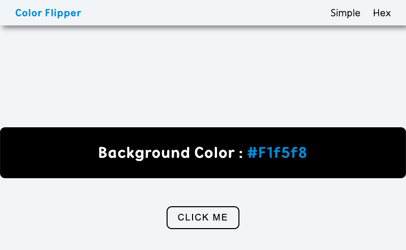

# Color Flipper

🔗 **Live Demo**
https://april-lwin.github.io/js-projects/color_flipper/

## Description
버튼을 클릭하면 배경색이 랜덤으로 변경되고, 현재 색상 값이 화면에 표시되는 간단한 컬러 변경 앱입니다.

## Features
Random background color change
Display current color value
DOM manipulation
Event handling

## Tech Stack
HTML
CSS
JavaScript

## What I Learned
배열(Array)과 랜덤 인덱스 활용
querySelector와 getElementById 차이
이벤트 발생 시 스타일과 텍스트 동적 변경

## Preview
 (../assets/screenshots/color_flipper2.png)
