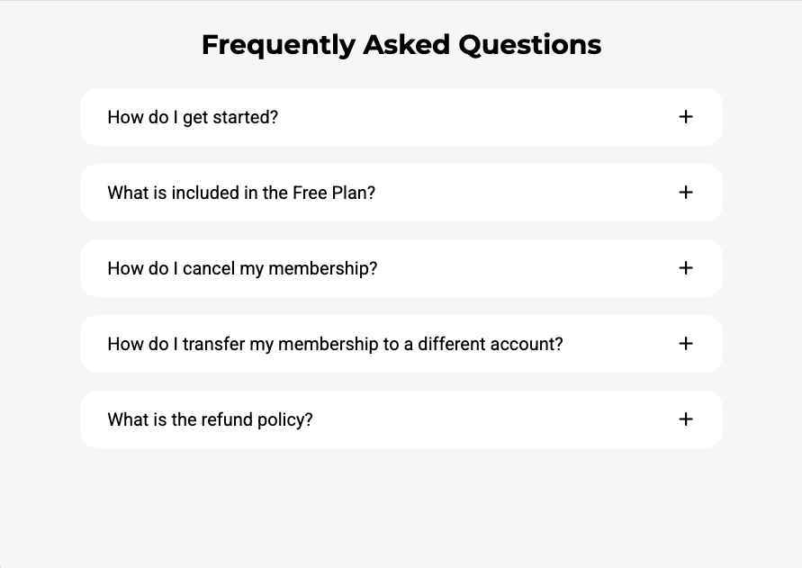
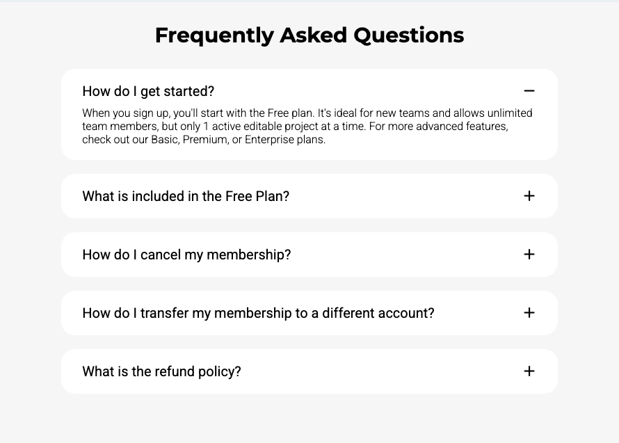

# FAQ Page

🔗 **Live Demo**
https://april-lwin.github.io/js-projects/faq_page/

## Description
This project is a simple and clean FAQ accordion built with HTML, CSS, and JavaScript. Users can click on a question to reveal its answer, and only one question can stay open at a time. The design focuses on readability, minimal UI, and smooth interaction using class toggling in JavaScript.
이 프로젝트는 HTML, CSS, JavaScript로 만든 간단하고 깔끔한 FAQ 아코디언입니다. 사용자가 질문을 클릭하면 답변이 나타나며, 동시에 하나의 질문만 열리도록 구현했습니다. JavaScript의 클래스 토글 방식을 사용해 부드러운 인터랙션과 가독성 높은 UI에 집중했습니다.

## Features
- Click to expand and collapse FAQ answers
- Only one question can be opened at a time
- Plus and minus icons toggle automatically
- Clean and responsive card-based layout

## Tech Stack
- HTML
- CSS
- JavaScript

## What I Learned
- How to close other elements while opening one (accordion behavior)
- DOM traversal using querySelector and forEach
- Writing cleaner and more reusable CSS with variables

## Preview
| Preview 1 | Preview 2 |
|-------------|----------|
|  |  |
