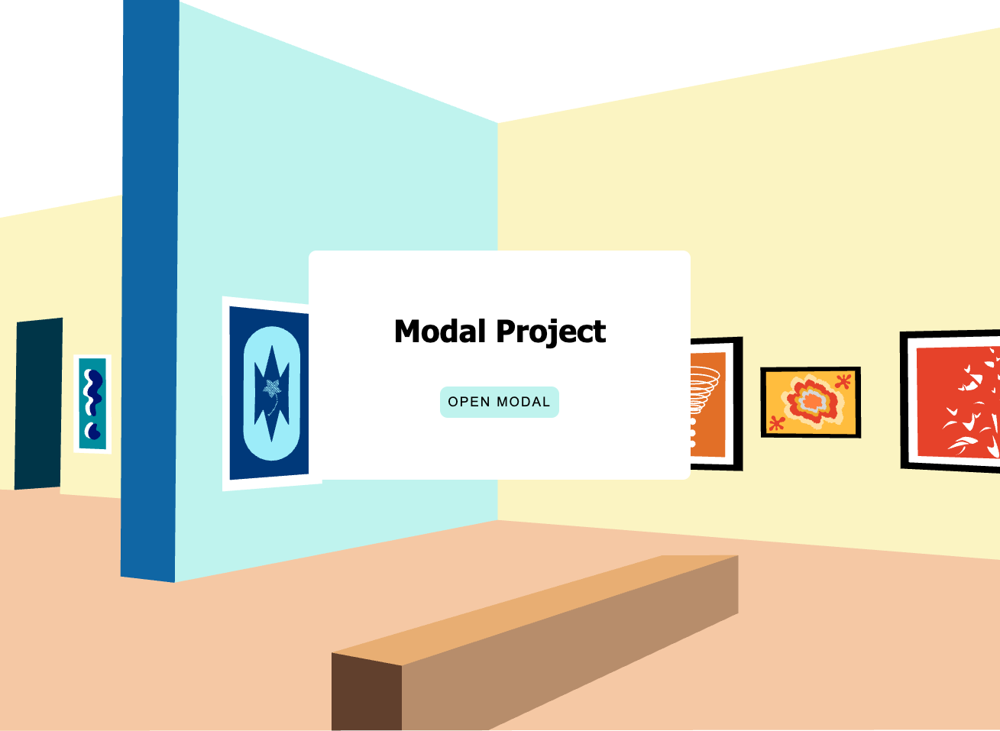
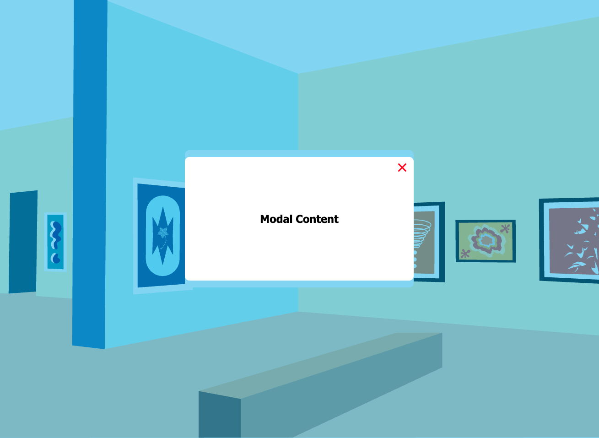

# Modal Project

🔗 **Live Demo**  
https://april-lwin.github.io/js-projects/modal_project/

## Description
A simple modal popup project built with HTML, CSS, and JavaScript. 
HTML, CSS, JavaScript로 만든 간단한 모달 팝업 프로젝트입니다.

## Feature
- Button click to open modal
- Close button to hide modal
- Background overlay that blocks interaction with the main page
- Centered modal layout using CSS

## Tech Stack
- HTML 
- CSS
- JavaScript

## What I Learned
- How to show and hide elements using CSS visibility and z-index
- How to add and remove classes with JavaScript event listeners
- Structuring modal components with overlay and container elements

## Preview
| Preview 1 | Preview 2 |
|-------------|----------|
|  |  |