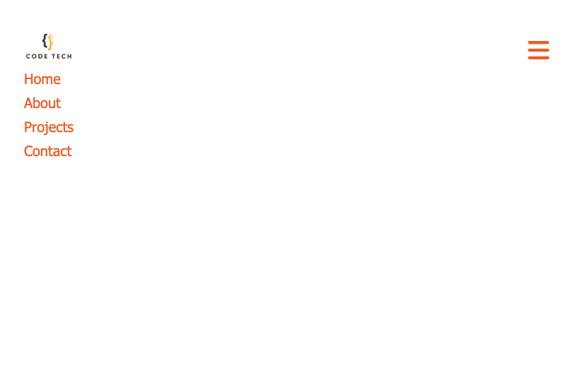

# Responsive Navbar

🔗 **Live Demo**  
https://april-lwin.github.io/js-projects/responsive_navbar/

## Description
A responsive navigation bar built with HTML, CSS, and JavaScript that adapts to different screen sizes. On smaller screens, a hamburger menu button appears to toggle the navigation links. 
Responsive으로 화면 크기에 따라 레이아웃이 자동으로 변경되며 작은 화면에서는 햄버거 메뉴 버튼을 통해 네비게이션 링크를 토글할 수 있게 한 연습입니다.

## Feature
- Responsive layout for desktop and mobile screens
- Hamburger menu toggle for screens under 810px
- Smooth show/hide animation using CSS transitions
- Social media icons displayed on desktop only

## Tech Stack
- HTML 
- CSS
- JavaScript

## What I Learned
- How to build a responsive navigation layout using Flexbox and media queries
- How to toggle classes with JavaScript to control UI states
- Managing element visibility using height and overflow properties

## Preview
| Preview 1 | Preview 2 |
|-------------|----------|
|  |  |