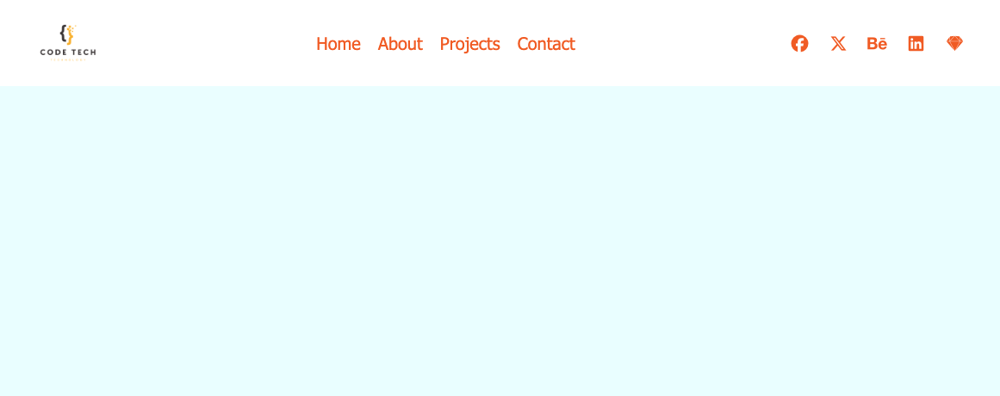

# Sidebar

🔗 **Live Demo**  
https://april-lwin.github.io/js-projects/sidebar/

## Description
A responsive navigation UI built with HTML, CSS, and JavaScript that behaves as a top navigation bar on desktop and a slide-in sidebar on mobile. HTML, CSS, JavaScript로 제작된 반응형 네비게이션 UI로, 데스크톱에서는 상단 네비게이션 바로 동작하고 모바일에서는 슬라이드 인 사이드바로 동작합니다.

The layout changes based on screen width using media queries. 미디어 쿼리를 사용해 화면 너비에 따라 레이아웃이 변경됩니다.

## Features
- Displays a horizontal navigation bar on screens wider than 676px
- Displays a slide-in sidebar menu on screens smaller than 676px
- Hamburger button toggles the sidebar on mobile view
- Close button allows users to hide the sidebar
- Smooth slide animation using CSS transform and transition

## Tech Stack
- HTML
- CSS
- JavaScript

## What I Learned
- How to build a responsive navigation system using multiple media queries
- Switching UI layouts between navbar and sidebar based on screen size
- Using CSS transform to create off-canvas sidebar animations
- Managing UI state by toggling CSS classes with JavaScript

## Preview
| Preview 1 | Preview 2 |
|-------------|----------|
|  |  |